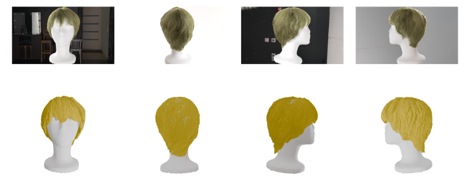

# Sparse View based Strand Accurate Hair Reconstrucion #
This repository is heavily based on (https://keyuwu-cs.github.io/MonoHair/ "MonoHair"). Please go through original repo for all the information before starting. 

We also use another work (https://github.com/elerac/strand_integration/ "Refinement of Hair Geometry by Strand Integration").

- We generate high resolution hair datasets replicating a calibrated light stage setup using models from (https://github.com/facebookresearch/CT2Hair "CT2Hair")
- We adapt MonoHair to work with limted calibrated views from our custom dataset.
- We include Strand Integration method results to replace mesh from [Instant-NGP](https://github.com/NVlabs/instant-ngp "Instant-NGP") for PMVO.
- We also try to regenrate results for real world light stage data.
- We try to explore the quantitative metrics for synthetic hair.

## Citation ##

    @inproceedings{wu2024monohair,
	  title={MonoHair: High-Fidelity Hair Modeling from a Monocular Video},
	  author={Wu, Keyu and Yang, Lingchen and Kuang, Zhiyi and Feng, Yao and Han, Xutao and Shen, Yuefan and Fu, Hongbo and Zhou, Kun and Zheng, Youyi},
	  booktitle={Proceedings of the IEEE/CVF Conference on Computer Vision and Pattern Recognition},
	  pages={24164--24173},
	  year={2024}
	}

	@article{maeda2023refinement,
    author = {Maeda, Ryota and Takayama, Kenshi and Taketomi, Takafumi},
    title = {Refinement of Hair Geometry by Strand Integration},
    journal = {Computer Graphics Forum (proceedings of Pacific Graphics)},
    volume = {42},
    number = {7},
    year = {2023}
    }

	@article{shen2023CT2Hair,
    title={CT2Hair: High-Fidelity 3D Hair Modeling using Computed Tomography},
    author={Shen, Yuefan and Saito, Shunsuke and Wang, Ziyan and Maury, Olivier and Wu, Chenglei and Hodgins, Jessica and Zheng, Youyi and Nam, Giljoo},
    journal={ACM Transactions on Graphics},
    volume={42},
    number={4},
    articleno={75},
    pages={1--13},
    year={2023},
    publisher={ACM New York, NY, USA}
    }

